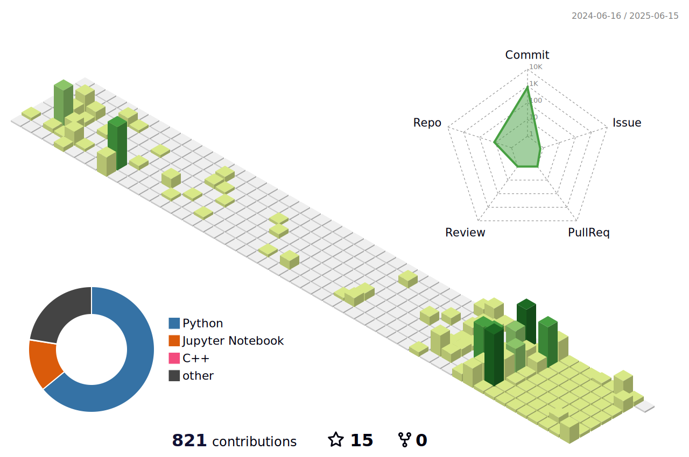

<!--

-->

# 👑 Hannibal's Empire 👑

- 📫 **e-mail:  cds730@naver.com**

- 🏫 **College:  [Konkuk.univ](https://www.konkuk.ac.kr/konkuk/index.do)**

- 📊 **Primary major:  [Applied Statistics](https://stat.konkuk.ac.kr/stat/index.do)**
- 🏭 **Double major:  [Industrial Engineering](https://kies.konkuk.ac.kr/kies/index.do)**

- ✨ **Interests:  Adversarial Attacks for Autonomous Vehicles**

- 💻 **Stacks:** 

 

| [Autonomous driving based on Pytorch Transfer Learning](https://github.com/Hannibal730/KONKUK-Univ_Autonomous-Driving-Competition ) |
| :-------------------------------------------------------------------------------------------- |
|    |

|direction|go|left|right|
|:---:|:---:|:---:|:---:|
|Preprocessed   train data|  |  | |

 
 

| [Lane Detection & Pure Pursuit for Steering Angle of Local Path Planning](https://github.com/Hannibal730/SlidingWindow-LaneDetection-PurePursuit) |
| :-------------------------------------------------------------------------------------------- |
|  |

 

| [3D Object Detection on Traffic Dataset](https://github.com/Hannibal730/nuScenes-3D-Detect-Track-Predict_ws) |
| :-------------------------------------------------------------------------------------------- |
|  |

 

| [3D Multi‑Object Tracking & Predicting Future-Position with Kalman Filter](https://github.com/Hannibal730/nuScenes-3D-Detect-Track-Predict_ws) |
| :-------------------------------------------------------------------------------------------- |
|  |
|  |

<!--

-->

